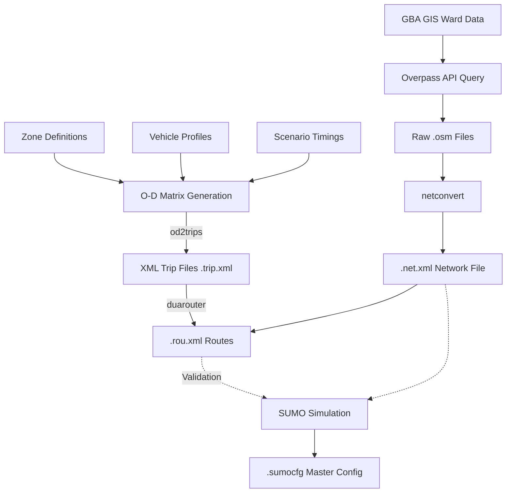

# Hierarchical Multi-Agent RL for Urban Traffic Control
**Comprehensive System Architecture & Methodology**

This document serves as the master blueprint for the entire urban traffic control system, covering data engineering pipelines, mathematical reinforcement learning foundations, the hierarchical multi-agent architecture, and evaluation protocols.

---

## 1. Data Engineering & Simulation Environment

### What is SUMO?
**SUMO (Simulation of Urban MObility)** is an open-source, highly portable, microscopic, and continuous traffic simulation package designed to handle large road networks. It operates at the microscopic level, meaning every individual vehicle is explicitly modeled with its own route, speed, and car-following/lane-changing dynamics. 

### What Files Does SUMO Need?
To run a simulation, SUMO inherently requires three primary components:
1. **Network File (`*.net.xml`)**: Describes the road topology, intersections (nodes), edges (roads), lanes, traffic lights, and right-of-way rules.
2. **Route File (`*.rou.xml`)**: Contains definitions of vehicles, their types, and the exact edges they will traverse over time.
3. **Configuration File (`*.sumocfg`)**: The master file that binds the network, routing, simulation step length, and outputs together.

### Map Data Acquisition Pipeline
To simulate real-world conditions, we map specific real geographical areas (e.g., Bangalore wards).
1. **GBA GIS Viewer**: We use the official GIS portal to identify accurate ward boundaries and spatial polygons.
2. **Overpass API**: Using the geographical bounding boxes/polygons, we query the Overpass API to extract raw map data from OpenStreetMap (OSM) specifically matching our wards. 
3. **`netconvert`**: The extracted `*.osm` files are raw textual topological maps. We pass them through SUMO's `netconvert` utility to translate raw nodes and ways into heavily annotated, simulation-ready `.net.xml` representations, complete with auto-generated traffic light logic for major intersections.

### Scenarios, Zone Types, and Vehicle Profiles
- **Zone Types**: The maps are semantically divided into specific zones (e.g., *Residential*, *Commercial*, *Tech Parks*). This categorization dictates the timing and volume of traffic (e.g., Tech Parks have massive inbound flow in the morning and outbound flow in the evening).
- **Vehicle Profiles**: Traffic isn't uniform. We define vehicle classes—Cars, Two-wheelers (Bikes), Buses, and Commercial vehicles. Each profile has distinct physics (acceleration, max speed, length) and emission characteristics configured in SUMO.
- **Scenarios**: We construct peak vs. non-peak scenarios. A "Morning Peak" scenario triggers routing generators to pour maximum capacity out of Residential zones into Tech Park zones.

### Route Generation Logic
Route generation bridges the gap between static map rules and dynamic simulation.

*Note on Route Validation*: If a generated Origin-Destination trip maps to a disconnected road segment during the `duarouter` phase, SUMO safely discards or refuses to route cars down that impossible path, preventing simulation crashes due to map fragmentation.

### Map Stitching & Allocation
When scaling vertically from a Ward to an Area or City, adjoining `.net.xml` geometries are stitched together. This requires boundary nodes to be mathematically merged. Allocation logic maps traffic flows naturally across borders so a continuous route seamlessly transitions from Ward A to Ward B without despawning.

---

## 2. Reinforcement Learning (RL) Foundation

### What is Reinforcement Learning?
Reinforcement Learning is an area of machine learning where an **Agent** learns to make decisions by taking **Actions** in an **Environment** to maximize a cumulative **Reward**. 

### Q-Learning & Deep Q-Learning (DQN)
- **Q-Learning**: A value-based algorithm that updates a lookup table (Q-Table) of values mapping States to Actions using the Bellman Equation: $Q(s, a) \leftarrow Q(s, a) + \alpha [r + \gamma \max Q(s', a') - Q(s, a)]$.
- **Fast/Deep Q-Learning (DQN)**: When the state space is too massive (like a traffic simulation), maintaining a table is impossible. DQN replaces the lookup table with a Deep Neural Network that approximates the Q-value. 

### Proximal Policy Optimization (PPO)
PPO is an **Actor-Critic** algorithm. Instead of guessing values (like DQN), it maintains two separate networks:
1. **The Actor**: Directly outputs the best policy (action probabilities) given a state.
2. **The Critic**: Evaluates how good the current state is to help train the Actor. 
PPO heavily restricts how much the policy can change in a single update step (via a "clipped" surrogate objective). This prevents the agent from forgetting a good strategy due to a single bad batch of experiences.

### Why PPO Performs Better Than DQN
- **Continuous and Stochastic Policies**: PPO handles probabilistic routing and complex state matrices better. 
- **Sample Efficiency and Stability**: DQN is prone to catastrophic instability in multi-agent continuous environments (chasing a moving target). PPO restricts policy deviation, guaranteeing monotonic improvement.
- **Hierarchical Play**: When wrapping agents inside other agents, stability is paramount. PPO's clipped objectives handle the cascading noise better than DQN.

### Action Space & Reward Function (In-Depth)
**Action Space (Discrete or Continuous):**
Depending on the specific layer:
1. **Phase Switching**: The action is an integer $[0, 1, 2, ...]$ corresponding to standard Light phases (North-South Green, East-West Green).
2. **Phase Duration Extension**: Output a continuous variable that dynamically extends the current green phase by $\Delta t$ seconds.

**Reward Function:**
The reward function drives the agent's behavior to eliminate congestion.
$R_t = (w_1 \times \text{Throughput}) - (w_2 \times \text{Cumulative Delay}) - (w_3 \times \text{Queue Length}) - (w_4 \times \text{Wait Time})$
By heavily penalizing queue length and wait time, the agent learns to flush out stalled lanes rather than just letting high-speed traffic move freely.

### Toolchain Integration (Stable Baselines3, Gymnasium, TraCI)
1. **TraCI (Traffic Control Interface)**: A Python API that connects over TCP to a running SUMO instance, allowing us to pause the simulation, inject commands (`traci.trafficlight.setPhase()`), and read metrics (sensors, queues).
2. **Gymnasium**: We wrap our TraCI simulation in a standard `gym.Env`. To the outside world, SUMO looks like a standard game with `reset()`, `step(action)`, and `observation` loop returns.
3. **Stable Baselines3 (SB3)**: Provides the hardened PPO implementations. SB3 simply calls `env.step()` repeatedly, unaware it's manipulating live Bangalore traffic.

---

## 3. Hierarchical System Architecture

The core innovation of this system is resolving the curse of dimensionality. A centralized City-wide AI cannot compute real-time light phases for 4,000 intersections. Therefore, we utilize a hierarchical divide-and-conquer approach.

### System Architecture Overview
The system is divided into three operating strata:
1. **Ward Layer (L1 - Microscopic)**: Controls individual intersections. Acts fast, responds to raw queues.
2. **Area Layer (L2 - Mesoscopic)**: Governs adjacent wards. Uses graph neural networks to coordinate green waves across corridors.
3. **City Layer (L3 - Macroscopic)**: Global routing and origin-destination manipulation.

### Parameter Traversal (Bottom-Up and Top-Down)
- **Directives from Upper to Lower**:
  - **City to Area**: The City computes a "Capacity Cap" based on global grid health and incident severity. This cap is sent directly to the **Area Layer** to modulate regional forecasting.
  - **Area to Ward**: The Area Layer (incorporating the City's cap) provides "Pressure Signals" to individual Ward agents to coordinate regional flow.
- **Observations from Lower to Upper (Bubble Up)**:
  - **Ward to Area**: Wards aggregate microscopic data (queue length, delay averages) up to the Area.
  - **Area to City**: Areas aggregate regional saturation levels, throughput, and incident alerts up to the City Layer.

### Ticks Logic (Synchronized Time Loops)
Execution frequency decreases as we climb the hierarchy:
- **Simulation Tick (SUMO)**: 1 sim second.
- **Ward Tick**: Every 10 seconds.
- **Area Tick**: Every 60 seconds (6 Ward intervals). Incorporates City-level caps into its STGCN predictions.
- **City Tick**: Every 300 seconds (5 Area intervals). Re-routes long-distance traffic and recalculates Area Capacity Caps.

### Ward Layer
Uses standard Deep RL (PPO). The state space array consists of current queue lengths on all incoming lanes, current phase index, and elapsed phase time. Action output changes the light. Note: Wards also receive top-down pressure signals filtered through the Area layer.

### Area Layer & STGCN
The Area layer acts as the primary coordinator. It receives traffic states from interconnected Wards and **exogenous capacity constraints from the City Layer**.
- **STGCN (Spatio-Temporal Graph Convolutional Network)**:
  - **Spatial (GCN)**: Applies graph convolutions to understand how a jam at intersection A will physically spill over into intersection B.
  - **Temporal (CNN/RNN)**: Uses time-series blocks to understand the acceleration/decay velocity of the jams.
  - **Exogenous Integration**: STGCN uses the City's "Capacity Cap" to scale its pressure predictions, effectively telling Wards how much traffic they are allowed to "accept" from the network.
- **Why STGCN?**: Standard neural nets struggle to map geographic realities natively. STGCN processes the topology directly via an adjacency matrix, ensuring the Area Agent understands that Ward A controls Ward B's future traffic.

### City Layer & NetworkX
The massive overarching system requires graph theory to manage flow. We utilize **NetworkX** to build the overarching topology. The entire city is represented as a directed graph where nodes correspond to Areas, and edges represent boundary capacities. This allows the L3 AI to use pathfinding algorithms (like Dijkstra or custom shortest-path flow algorithms) to rebalance the grid.
- **Cap Generation**: The City Layer calculates the optimal capacity limit for each Area and pushes this directive down to the **Area Layer** during its 300s tick.

---

## 4. Evaluation 

### Evaluation Metrics 
*[Placeholders to be expanded with final empirical formulas and tracking dashboards]*
- **Average Intersection Delay (s/vehicle)**: 
  - `[PLACEHOLDER]`
- **Global Network Setup/Flush Time (Simulation completion time)**: 
  - `[PLACEHOLDER]`
- **Average Queue Length (vehicles/lane)**: 
  - `[PLACEHOLDER]`
- **Carbon Emission Estimates (CO2/NOx)**: 
  - `[PLACEHOLDER]`

### System Evaluation
*[Placeholders to be expanded post training]*
- **Baseline Comparison (Fixed Time vs. Actuated vs. Hierarchical-RL)**: 
  - `[PLACEHOLDER]`
- **Stress Testing (Peak Hour Spikes)**: 
  - `[PLACEHOLDER]`
- **Ablation Studies (Removing Area Layer vs Full Hierarchy)**: 
  - `[PLACEHOLDER]`
